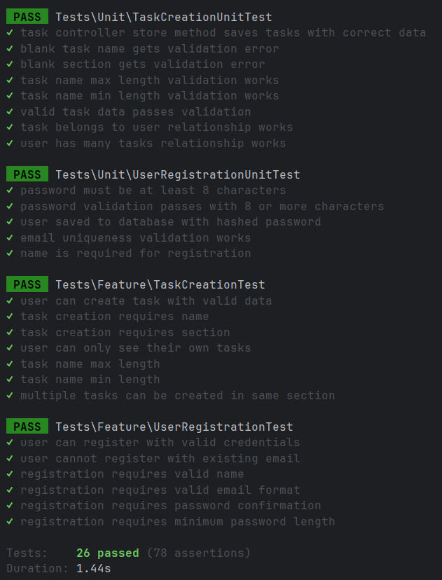

# <ins>Test Plan</ins>

This test plan follows the V-model, where each software development phase has a corresponding testing phase:

- **User Stories** are part of the Software Specifications, which is linked to System Testing
- **System Tests** are used for System Testing, they validate the functionality of the user stories
- **Unit Tests** are used for Unit Testing, they make sure that individual components work correctly on their own

## User Story 1: Account Registration
As a visitor, I want to be able to register an account, so that I can log in and manage my tasks.

**Main flow:**
Given that a visitor is on the account registration page, when they input a valid name, email address, and password, then their account will be saved and they will be redirected to the home page.

**Exception flow:**
Given that a visitor is on the account registration page, when they input an email address that is already registered and try to proceed, then they will see an error that the email has already been taken.

### System Tests:
- **Test:** Register with valid name, email, and password   **Result:** Get redirected to homepage
- **Test:** Register with existing email   **Result:** Receive "This email has already been taken" error

### Unit Tests:
- Password must be at least 8 characters
- User saved to database with hashed password

**Why?**  
These tests validate the complete user registration process, from the UI interaction to the database storage. Both happy and unhappy paths are tested to ensure that the user story requirements are met.
Concerning the unit tests, I chose to test password validation and hashing because these are really important parts of security, and it's vital that they function correctly apart from each other.

## User Story 2: Task Creation
As a logged in user, I want to be able to create a task, so that I can keep track of what I still have to do.

**Main flow:**
Given that a logged in user is on the task creation page, when they choose a section and input a task name, then their task will be created and shown on the home page.

**Exception flow:**
Given that a logged in user is on the task creation page, when they leave the task name field blank, then they will see an error asking them to enter a task name.

### System Tests:
- **Test:** Create new task with valid section and task name   **Result:** Task appears in list on index page
- **Test:** Task name is left blank   **Result:** Receive "Please enter a task name" error

### Unit Tests:
- TaskController store method saves tasks with the correct data
- Missing task name triggers validation error

**Why?**  
The system tests verify that the task creation, from user input through to display on the homepage, functions correctly. Both happy and unhappy paths are tested to ensure that the user story requirements are met.
Regarding the unit tests, I tested the TaskController's data handling logic and validation rules, as these are core business components that should function correctly apart from each other. These tests ensure that the task creation logic works correctly regardless of any outside factors, such as UI implementation.

# <ins>Test Results</ins>

As you can see above, I tested not only the happy and unhappy paths of my user stories, but multiple edge cases as well.

# <ins>Evaluation</ins>
### Errors That CAN Be Detected by These Tests:
The tests I've made detect several different kinds of issues, which I've listed below.

<ins>**Validation**</ins>  
**Missing required fields:** Tests verify that task names and sections are required, and user names are mandatory for registration  
**Input length violations:** Both minimum and maximum length constraints are tested for task names and password requirements  
**Format validation:** Email format validation ensures proper email structure during registration  
**Uniqueness constraints:** Email uniqueness is tested to prevent duplicate user accounts

<ins>**Data Integrity**</ins>  
**Password security:** Tests ensure passwords are properly hashed before database storage rather than stored in plain text  
**Authentication and authorization:** Tests verify users can only access their own tasks, preventing unauthorized data access  
**Database relationship integrity:** Tests confirm that task-user relationships work correctly in both directions

<ins>**Business Logic**</ins>  

**Task creation workflow:** Tests verify the complete task creation process works with valid data  
**User registration workflow:** Tests confirm the registration process functions properly with valid credentials  
**Data persistence:** Tests ensure that created tasks and users are properly saved to the database

### Errors That CAN'T Be Detected by These Tests:
While the tests above cover many possible cases, they are not exhaustive. Below I've listed some things that the tests do not cover.  

**Database connectivity failures:** Tests don't verify behavior when the database is unavailable or connections fail
**Performance issues:** No load testing to detect performance degradation under high user volumes or large datasets
**Cross-browser compatibility:** Browser-specific rendering or functionality issues remain undetected
**Accessibility compliance:** No verification that the application meets accessibility standards
**Mobile responsiveness:** No testing of mobile device compatibility or responsive design
**Cross-Site Request Forgery (CSRF):** No verification of CSRF token validation
**Network failures:** No testing of behavior during network interruptions or timeouts

### Conclusion
Based on the automated testing, basic CRUD operations for tasks and users function correctly.
Input validation, database relationships and data persistence, and authentication are all working as expected.
However, I can't with 100% certainty say that everything works correctly. Although I believe that I've created a good "testing base" that covers most of the main functionality,
there's a lot of problems that real world applications face, such as system failures and security threats, that I haven't tested here. Not only that, but the tests I've made are run in a controlled
environment. In the real world, things can behave unpredictably, and new issues can appear that wouldn't affect basic unit and system testing. Because of this, I am unable to say that "everything works correctly",
however, I believe that what I have tested is fully functioning and I am confident that it can continue to function under normal conditions.
