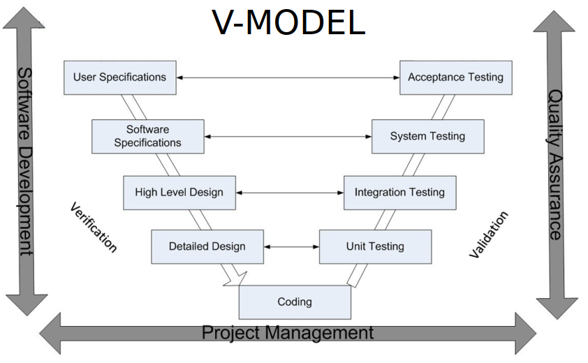

# <ins>Test Plan</ins>

This test plan follows the V-model, where each software development phase has a corresponding testing phase:

- **User Stories** are part of the Software Specifications, which is linked to System Testing
- **System Tests** are used for System Testing, they validate the functionality of the user stories
- **Unit Tests** are used for Unit Testing, they make sure that individual components work correctly on their own

## User Story 1: Account Registration
As a visitor, I want to be able to register an account, so that I can log in and manage my tasks.

**Main flow:**
Given that a visitor is on the account registration page, when they input a valid name, email address, and password, then their account will be saved and they will be redirected to the home page.

**Exception flow:**
Given that a visitor is on the account registration page, when they input an email address that is already registered and try to proceed, then they will see an error that the email has already been taken.

### System Tests:
- **Test:** Register with valid name, email, and password   **Result:** Get redirected to homepage
- **Test:** Register with existing email   **Result:** Receive "This email has already been taken" error

### Unit Tests:
- Password must be at least 8 characters
- User saved to database with hashed password

**Why?**  
These tests validate the complete user registration process, from the UI interaction to the database storage. Both happy and unhappy paths are tested to ensure that the user story requirements are met.
Concerning the unit tests, I chose to test password validation and hashing because these are really important parts of security, and it's vital that they function correctly apart from each other.

## User Story 2: Task Creation
As a logged in user, I want to be able to create a task, so that I can keep track of what I still have to do.

**Main flow:**
Given that a logged in user is on the task creation page, when they choose a section and input a task name, then their task will be created and shown on the home page.

**Exception flow:**
Given that a logged in user is on the task creation page, when they leave the task name field blank, then they will see an error asking them to enter a task name.

### System Tests:
- **Test:** Create new task with valid section and task name   **Result:** Task appears in list on index page
- **Test:** Task name is left blank   **Result:** Receive "Please enter a task name" error

### Unit Tests:
- TaskController store method saves tasks with the correct data
- Missing task name triggers validation error

**Why?**  
The system tests verify that the task creation, from user input through to display on the homepage, functions correctly. Both happy and unhappy paths are tested to ensure that the user story requirements are met.
Regarding the unit tests, I tested the TaskController's data handling logic and validation rules, as these are core business components that should function correctly apart from each other. These tests ensure that the task creation logic works correctly regardless of any outside factors, such as UI implementation.
